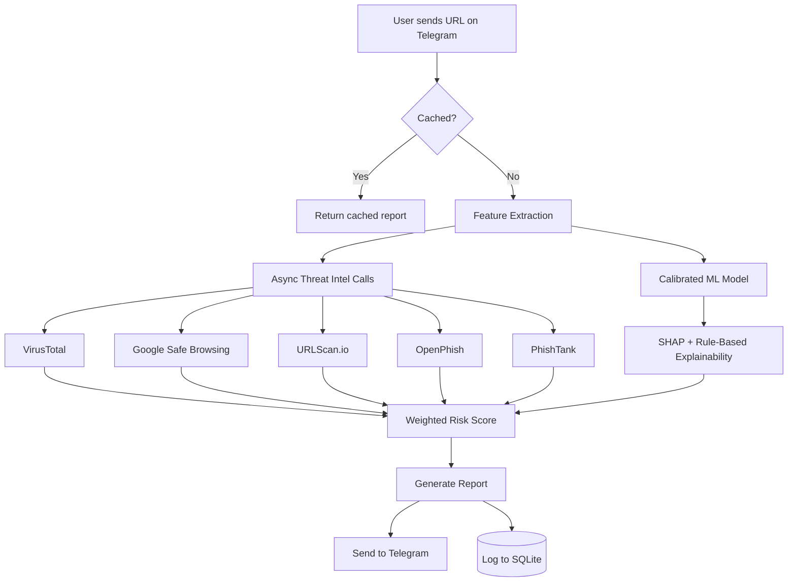

# 🔒 SecureLink AI

**AI-powered URL security analyzer with a Telegram bot interface.**

Forward any suspicious link to the bot — it combines machine learning, rule-based heuristics, and free threat-intelligence APIs to return an explainable Trust Score (0–100), not just "safe" or "unsafe."

> ⚠️ **Current model status:** The shipped model is trained on **synthetic data** for demo/CI purposes and is **not yet suitable for real threat detection**. See [Model Status](#model-status) below before relying on any prediction.

---

## Table of Contents

- [Features](#features)
- [Architecture](#architecture)
- [Model Status](#model-status)
- [Tech Stack](#tech-stack)
- [Project Structure](#project-structure)
- [Setup & Installation](#setup--installation)
- [Running Locally](#running-locally)
- [Environment Variables](#environment-variables)
- [Testing](#testing)
- [Limitations](#limitations)
- [Roadmap](#roadmap)
- [Screenshots](#screenshots)

---

## Features

- **Telegram bot** — send a URL, get back a Trust Score, prediction, confidence, and plain-English reasons
- **Calibrated ML classification** (XGBoost) combined with rule-based heuristics
- **Explainable AI** — SHAP-based feature attribution merged with human-readable rule explanations
- **Threat intelligence integration** — VirusTotal, Google Safe Browsing, URLScan.io, OpenPhish, PhishTank (all free-tier)
- **Async, cache-first API orchestration** — results are cached to respect strict free-tier rate limits and keep response times low
- **Graceful degradation** — if an external API is down or rate-limited, the bot still returns a score using ML + rules
- **30+ engineered features** — URL structure, domain age (WHOIS), SSL certificate details, entropy, keyword patterns, and more
- **Feedback loop** — users can flag predictions as correct/incorrect (👍/👎), logged for future retraining
- **Streamlit dashboard** — scan history, model performance metrics, confusion matrix, SHAP summary, feedback review, and a basic drift monitor
- **Per-user rate limiting** to prevent abuse of shared free-tier API quotas
- **Automated tests + CI** (GitHub Actions: lint + test on every push)

---

## Architecture



**Scoring formula (fixed weights, tunable via config):**

```
Risk Score = 0.50 × ML probability
           + 0.25 × VirusTotal detection ratio
           + 0.15 × Google Safe Browsing flag
           + 0.10 × Rule-engine score
```

---

## Model Status

| | Status |
|---|---|
| Training data | Synthetic (procedurally generated, 5,000 rows) |
| Real-data training | Not yet completed |
| Reported metrics | Not meaningful (100% accuracy on synthetic data is expected, not a sign of a working detector) |

**To make this a genuine ML-integrated application:** train on the real **PhiUSIIL Phishing URL Dataset** (235,795 real URLs, Prasad & Chandra, 2024) via `ucimlrepo` or Kaggle, then rerun `scripts/train_model.py`. Once complete, `models/model_metadata.json` will reflect `"data_source": "real"` and this section (and the dashboard warning) should be updated with the real, verified metrics.

---

## Tech Stack

Python 3.12 · FastAPI · python-telegram-bot · Scikit-learn · XGBoost · SHAP · Streamlit · SQLite/SQLModel · httpx (async) · python-whois · tldextract · pytest · GitHub Actions · Docker

---

## Project Structure

```
SecureLink-AI/
├── app/            # Core logic: config, features, model, inference, explainability, API clients, cache
├── bot/            # Telegram bot: handlers, keyboards, rate limiting
├── dashboard/      # Streamlit dashboard
├── data/           # raw/ (place real dataset here) and processed/
├── models/         # Trained model, scaler, metadata
├── scripts/        # Training + smoke test scripts
├── tests/          # Unit + mocked integration tests
├── .github/workflows/  # CI pipeline
├── Dockerfile
└── requirements.txt
```

---

## Setup & Installation

```bash
git clone <your-repo-url>
cd SecureLink-AI
pip install -r requirements.txt
```

> **Windows note:** SHAP requires Microsoft Visual C++ Build Tools to compile locally. Without it, the app falls back to rule-based explanations only. SHAP installs cleanly on Linux/Docker.

### 1. Configure environment variables

```bash
cp .env.example .env
```

Fill in the values — see [Environment Variables](#environment-variables) below for where to get each one.

### 2. Train the model

```bash
python scripts/train_model.py
```

Trains on synthetic data by default if no real CSV is present in `data/raw/`. See [Model Status](#model-status) to train on real data instead.

---

## Running Locally

```bash
# Terminal 1 — Telegram bot (polling mode)
python bot/telegram_bot.py

# Terminal 2 — Dashboard
streamlit run dashboard/streamlit_app.py
```

For production, set `WEBHOOK_URL` to switch the bot from polling to webhook mode.

---

## Environment Variables

| Variable | Where to get it |
|---|---|
| `TELEGRAM_BOT_TOKEN` | [@BotFather](https://t.me/botfather) on Telegram |
| `VIRUSTOTAL_API_KEY` | Free account at [virustotal.com](https://virustotal.com) |
| `GOOGLE_SAFE_BROWSING_KEY` | Free key via [Google Cloud Console](https://console.cloud.google.com) (enable "Safe Browsing API") |
| `URLSCAN_API_KEY` | Free account at [urlscan.io](https://urlscan.io) |
| `PHISHTANK_API_KEY` | Free registration at [phishtank.com](https://phishtank.com/api_register.php) |
| `WEBHOOK_URL` | Only needed in production deployment |

---

## Testing

```bash
pytest tests/ -v
ruff check .
```

---
