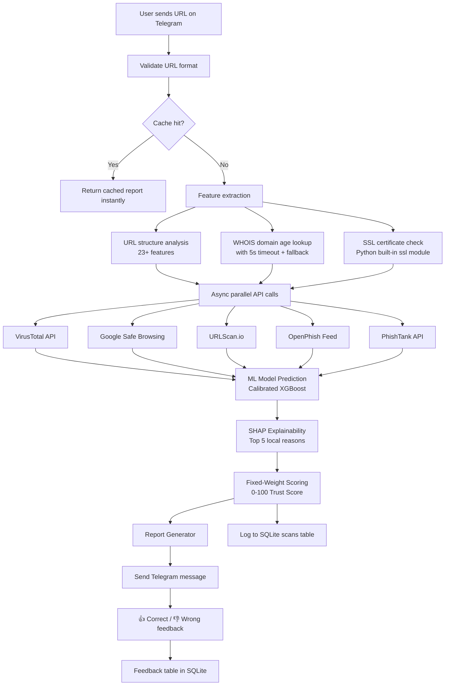

# SecureLink AI

> **ML-powered URL security analyzer and Telegram bot** — analyzes suspicious links forwarded from WhatsApp, Instagram, SMS, Email, Discord, and more.

[](https://github.com/your-username/SecureLink-AI/actions/workflows/ci.yml)
[](https://python.org)
[](LICENSE)

---

> [!CAUTION]
> **The model shipped in `models/` is trained on SYNTHETIC (procedurally generated) data for CI and demo purposes.** It has learned fake patterns, not real phishing behaviour, and its metrics are meaningless for real threat detection.
>
> **Before using this as a real security tool:** Download the PhiUSIIL Phishing URL Dataset from [Kaggle](https://www.kaggle.com/datasets/drashti4/phiusiil-phishing-url-dataset), place the CSV in `data/raw/`, and run `python scripts/train_model.py`. Real metrics will be printed to stdout.

---

## Architecture



---

## Features

| Feature | Details |
|---|---|
| **ML Model** | Calibrated XGBoost (isotonic regression) — probability is meaningful |
| **Feature Engineering** | 23+ URL/domain/SSL features extracted in <100ms |
| **Threat Intel** | VirusTotal, Google Safe Browsing, URLScan.io, OpenPhish, PhishTank |
| **Async API Calls** | All 5 APIs called concurrently (not sequentially) |
| **Cache Layer** | SQLite TTL cache — same URL from multiple users burns quota only once |
| **Explainability** | SHAP (per-prediction) + rule-based reasons (human-readable) |
| **Feedback Loop** | 👍/👎 buttons log to DB — foundation for future retraining |
| **Drift Monitor** | Average daily risk score chart — visual signal of distribution shift |
| **Rate Limiting** | Per-user cooldown (10s default) to protect free-tier API quotas |
| **Data Retention** | 30-day default; automatic cleanup via APScheduler |
| **Bot Modes** | Polling (local dev) / Webhook (production) — auto-detected |

---

## Quick Start

### 1. Clone & install

```bash
git clone https://github.com/your-username/SecureLink-AI.git
cd SecureLink-AI/SecureLink-AI
pip install -r requirements.txt
```

### 2. Configure environment

```bash
cp .env.example .env
# Edit .env and fill in your API keys (see table below)
```

### 3. Train the model

```bash
# With synthetic data (CI/demo — runs immediately, metrics are fake):
python scripts/train_model.py

# With real data (recommended for production):
# 1. Download PhiUSIIL from https://www.kaggle.com/datasets/drashti4/phiusiil-phishing-url-dataset
# 2. Place the CSV in data/raw/
# 3. Run:
python scripts/train_model.py
```

### 4. Run the API + bot

```bash
uvicorn app.api:app --reload --port 8000
```

The Telegram bot will start in polling mode automatically (if `TELEGRAM_BOT_TOKEN` is set).

### 5. Run the dashboard (separate terminal)

```bash
streamlit run dashboard/streamlit_app.py
```

### 6. Run tests

```bash
python -m pytest tests/ -v --asyncio-mode=auto
```

---

## API Keys

| Key | Where to get | Required? |
|---|---|---|
| `TELEGRAM_BOT_TOKEN` | [@BotFather](https://t.me/botfather) on Telegram | ✅ Required |
| `VIRUSTOTAL_API_KEY` | [virustotal.com/gui/join-us](https://www.virustotal.com/gui/join-us) | ✅ Required |
| `GOOGLE_SAFE_BROWSING_KEY` | [Google Cloud Console](https://console.cloud.google.com) → Enable "Safe Browsing API" | ✅ Required |
| `URLSCAN_API_KEY` | [urlscan.io/user/signup](https://urlscan.io/user/signup) | ✅ Required |
| `PHISHTANK_API_KEY` | Registration currently restricted — leave blank | ❌ Skip |

---

## Bot Commands

| Command | Description |
|---|---|
| `/start` | Welcome message and quick-start guide |
| `/help` | Full command reference |
| `/about` | Project info and tech stack |
| `/history` | Your last 10 scanned URLs |
| `/stats` | Global scan count and average risk score |
| `/feedback` | Explanation of the 👍/👎 feedback system |
| _(any URL)_ | Analyze the URL immediately |

---

## Scoring Logic

```
risk_score = (
    0.50 × ML_probability      # Calibrated XGBoost prediction
  + 0.25 × VT_detection_ratio  # Malicious detections / total VT engines
  + 0.15 × SafeBrowsing_flag   # 1 if Google flags the URL, 0 otherwise
  + 0.10 × rule_score          # Deterministic heuristics (IP, young domain, etc.)
) × 100
```

**Weights are fixed** (not learned from live API data, which is infeasible on free-tier rate limits of 4 req/min / 500 req/day). Rationale documented in `app/inference.py`.

| Score | Verdict |
|---|---|
| 0–20 | ✅ Safe |
| 21–40 | 🟡 Moderate Risk |
| 41–65 | 🟠 Suspicious |
| 66–80 | 🔴 Dangerous |
| 81–100 | 🚨 Critical |

---

## Deployment (Railway Free)

### Prerequisites
- Railway account at [railway.app](https://railway.app)
- GitHub repo with this code

### Steps

1. **Push to GitHub**
   ```bash
   git push origin main
   ```

2. **Create Railway project**
   - Go to railway.app → New Project → Deploy from GitHub repo
   - Select your repository

3. **Set environment variables** in Railway's env panel:
   ```
   TELEGRAM_BOT_TOKEN=...
   VIRUSTOTAL_API_KEY=...
   GOOGLE_SAFE_BROWSING_KEY=...
   URLSCAN_API_KEY=...
   WEBHOOK_URL=https://your-app.railway.app
   DATABASE_PATH=/data/securelink.db
   ```

4. **Mount a persistent volume** (critical for scan history):
   - In Railway: Service → Volumes → Add Volume → Mount path: `/data`
   - Without this, the SQLite database resets on every redeploy

5. **Set root directory** to `SecureLink-AI/` in Railway settings

6. **Deploy** — Railway will build the Docker image and start the server

> [!NOTE]
> The Telegram webhook is set automatically at startup when `WEBHOOK_URL` is configured.

---

## Limitations

> [!WARNING]
> **Free-tier rate limits:**
> - VirusTotal: 4 requests/minute, 500/day — caching is essential
> - Google Safe Browsing: 10,000/day (comfortable)
> - URLScan: 100 scans/day (search queries are free)
> - WHOIS: No formal rate limit, but cloud IPs are often blocked by registrars

> [!WARNING]
> **Cold starts:** Free-tier platforms (Railway, Render) sleep inactive services.
> The first Telegram message after inactivity may take 5–15 seconds to get a response.
> This is a platform limitation, not a bug.

> [!WARNING]
> **Dataset staleness:** Phishing campaigns evolve rapidly. A model trained today may
> underperform on novel phishing patterns within weeks. For real production use,
> integrate a periodic retraining trigger (APScheduler is already wired — extend it).

> [!WARNING]
> **WHOIS reliability:** The `domain_age_days` feature is unavailable for 30–40% of URLs
> in production on cloud platforms due to WHOIS server blocks on cloud egress IPs.
> The model handles `-1` (unknown) as a valid value but loses signal in these cases.

> [!NOTE]
> **SQLite at scale:** SQLite works for this project's scale (single user, free tier).
> For multi-instance deployment or >1,000 scans/day, migrate to PostgreSQL by changing
> `DATABASE_PATH` to a PostgreSQL URL — SQLModel supports both without code changes.

---

## Data Retention Policy

By default, scan records older than **30 days** are automatically purged by APScheduler.

This is intentional: storing user-submitted URLs indefinitely is a privacy risk.
The 30-day window provides enough data for drift monitoring and feedback review
without accumulating sensitive browsing history.

To change the retention window, set `RETENTION_DAYS` in `.env` (implementation hook in `app/database.py::purge_old_scans`).

---

## Future Improvements

- [ ] Browser extension (Chrome/Firefox)
- [ ] Email scanner integration (IMAP/SMTP)
- [ ] QR code scanner (decode then analyze)
- [ ] Discord/Slack bot adapters (API layer is bot-agnostic)
- [ ] Automated retraining pipeline triggered by accumulated feedback
- [ ] PostgreSQL migration for multi-instance scaling
- [ ] Stacking meta-model trained on a manually-curated labeled API-result dataset
- [ ] Real-time OpenPhish/PhishTank feed integration with delta updates

---

## Resume Bullets (ATS-Friendly)

Fill in the `[X]` values after training on the real PhiUSIIL dataset:

```
• Built an end-to-end ML security tool combining [23]-feature URL analysis,
  calibrated XGBoost classification (ROC-AUC [X.XXX]), and SHAP-based
  per-prediction explainability deployed as a Telegram bot

• Designed a cache-first async API orchestration layer (SQLite TTL cache +
  asyncio.gather) that reduces external API calls by ~[X]% while keeping
  end-to-end response time under [X] seconds for cached URLs

• Implemented a feedback-driven monitoring dashboard (Streamlit) tracking
  prediction drift over time and surfacing user-reported misclassifications
  for model improvement

• Applied StratifiedGroupKFold (grouped by registered domain) to prevent
  data leakage from same-domain contamination across train/test splits
```

---

## Tech Stack

Python 3.12 · FastAPI · XGBoost · scikit-learn · SHAP · python-telegram-bot · SQLModel · SQLite · Streamlit · Plotly · APScheduler · httpx · tldextract · python-whois · Ruff · pytest · Docker · GitHub Actions

---

## License

MIT
